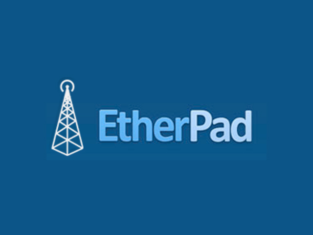

Etherpad
========
*Simple, lightweight and secure Etherpad container based on Alpine Linux*



### What is Etherpad ?
A really-real time collaborative word processor for the web.
You can find their repo [here](https://github.com/ether/etherpad-lite).

### Goal of this container
Propose a lightweight and secure container that is easy to setup.

### Features
- Based on Alpine Linux.
- No Root processes, as secure as possible.

### Build-time variables
- **WELCOME_TEXT**: (Optional) The placeholder text of a new pad
- **ETH_SKIN**: (Optional) The displayed skin of etherpad
- **ETH_TITLE**: (Optional) The title of etherpad
- **UID**: (Optional) The UID executing the server
- **GID**: (Optional) The GID executing the server

### Ports
- **9001**

### Volumes
- **/etherpad/data**: directory where the data is stored

### Setup
Build this image:
```
docker build -t etherpad .
```
Example command to run this container:
```
docker run -d -p 80:9001 --name etherpad etherpad
```
