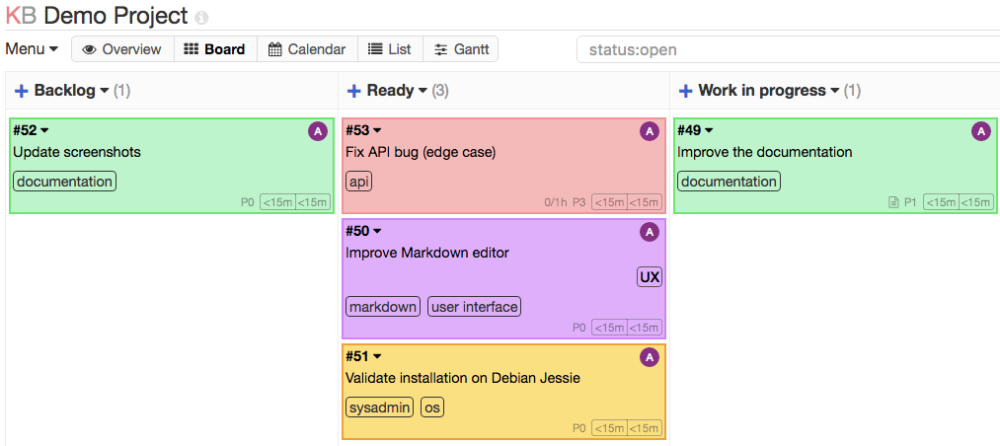

Kanboard
========
*Simple, lightweight and secure Kanboard container based on Alpine Linux*



### What is Kanboard ?
[Kanboard](https://kanboard.org/) is a free and open source Kanban project management software. You can find the official repository [here](https://github.com/kanboard/kanboard).

### Goal of this container
Propose a lightweight and secure container that is easy to setup.

### Features
- Based on Alpine Linux.
- No Root processes, as secure as possible.

### Run-time variables
- **UID**: (Optional) The UID executing the server
- **GID**: (Optional) The GID executing the server

### Ports
- **8080**

### Volume
- **/kanboard/data**: Data folder.

### Setup
Example command to build this image:
```
docker build -t kanboard .
```
Example command to run this container:
```
docker run -d -p 8080:8080 --name kanboard kanboard
```
